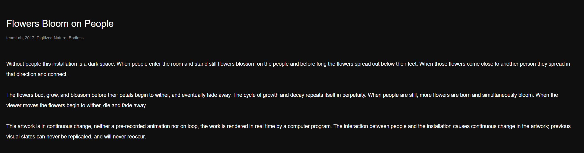
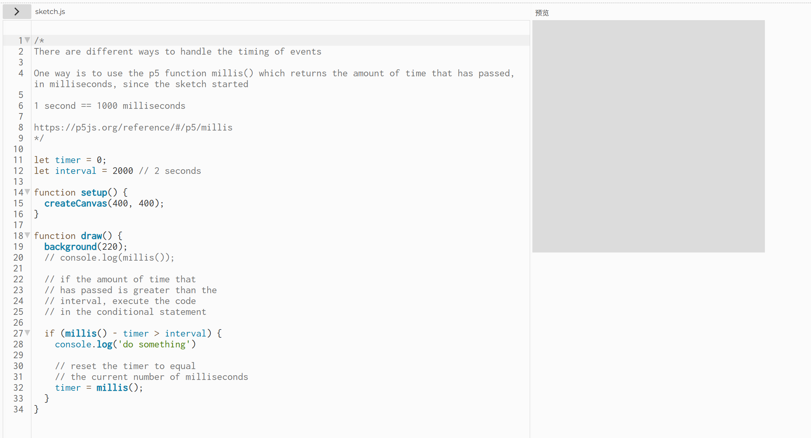
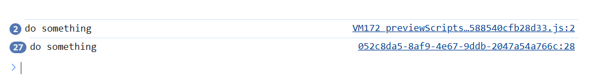

# Quiz 8: Design Research
Quiz 8 design research for a creative coding project using p5.js.

Jiayi Hou 

ID: jhou0739

## Part 1: Imaging Technique Inspiration
### Inspiration Example
**Artwork / Project:** *Flowers Bloom on People*  
**Artist / Studio:** teamLab  
**Year:** 2017  
**Technique focus:** Time-based blooming and fading visual effect  
**Source:** [teamLab — Flowers Bloom on People](https://www.teamlab.art/w/flowersbloom-on-people/)

### Images

### Short Discussion
I am inspired by teamLab’s *Flowers Bloom on People*, especially the way digital flowers appear, grow, bloom, and fade over time. Rather than recreating a physical projection installation, I want to adapt this time-based blooming and fading effect into a p5.js canvas artwork. This technique is useful because it can make a digital image feel alive and constantly changing. It also connects well with my chosen time-based mechanic, because timers can control when visual elements appear, expand, fade, and reset.

---

## Part 2: Coding Technique Exploration

### Coding Technique
**Technique:** p5.js `millis()` timer  
**Purpose:** To control timed visual events and animation stages.

This technique uses the p5.js `millis()` function to track how much time has passed since the sketch started. By comparing the current time with a saved timer value, different events can be triggered after a set interval, such as every two seconds.

### Coding Technique Image

### Short Discussion
The coding technique I want to explore is using p5.js `millis()` to control timed visual events. This technique could help recreate the gradual blooming and fading effect from my inspiration example. By checking how much time has passed, different visual stages can be triggered, such as a flower appearing, expanding, changing colour, fading away, and restarting. This supports my chosen time-based mechanic because the artwork can change over time.

### Links
[Technique Reference: p5.js millis()](https://p5js.org/reference/p5/millis/)

[Example Implementation: Timing Events with millis()](https://editor.p5js.org/enickles/sketches/MBgdwrdPB)

[Example Code: Timing Events with millis()](https://editor.p5js.org/enickles/sketches/MBgdwrdPB)

---

## References / Sources
The inspiration images are screenshots taken from the teamLab artwork page listed below.  
The coding technique images are screenshots taken from the p5.js Web Editor example listed below.

enickles. (n.d.). *Timing events with millis()* [p5.js sketch]. p5.js Web Editor. https://editor.p5js.org/enickles/sketches/MBgdwrdPB

p5.js. (n.d.). *millis()*. https://p5js.org/reference/p5/millis/

teamLab. (2017). *Flowers Bloom on People*. https://www.teamlab.art/w/flowersbloom-on-people/
